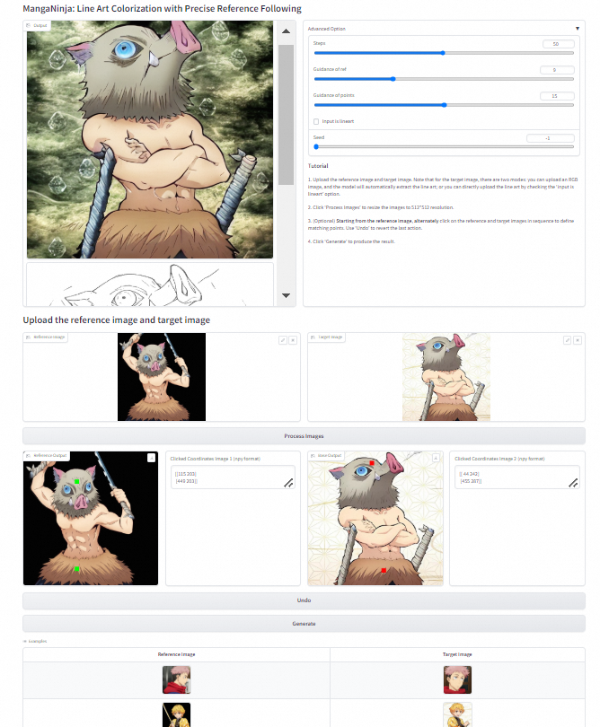

# MangaNinja: Line Art Colorization with Precise Reference Following

This repository represents the official implementation of the paper titled "MangaNinja: Line Art Colorization with Precise Reference Following".

[](https://johanan528.github.io/MangaNinjia/)
[](https://arxiv.org/abs/2312.02145)
[](https://www.apache.org/licenses/LICENSE-2.0)

<p align="center">
    <a href="https://johanan528.github.io/"><strong>Zhiheng Liu*</strong></a>
    ·
    <a href="https://felixcheng97.github.io/"><strong>Ka Leong Cheng*</strong></a>
    ·
    <a href="https://xavierchen34.github.io/"><strong>Xi Chen</strong></a>
    ·
    <a href="https://jiexiaou.github.io/"><strong>Jie Xiao</strong></a>
    ·
    <a href="https://ken-ouyang.github.io/"><strong>Hao Ouyang</strong></a>
    ·
    <a href="https://scholar.google.com/citations?user=Mo_2YsgAAAAJ&hl=zh-CN"><strong>Kai Zhu</strong></a>
    ·
    <a href="https://scholar.google.com/citations?user=8zksQb4AAAAJ&hl=zh-CN"><strong>Yu Liu</strong></a>
    ·
    <a href="https://shenyujun.github.io/"><strong>Yujun Shen</strong></a>
    ·
    <a href="https://cqf.io/"><strong>Qifeng Chen</strong></a>
    ·
    <a href="http://luoping.me/"><strong>Ping Luo</strong></a>
    <br>
  </p>

We propose **MangaNinja**, a reference-based line art colorization method. MangaNinja
automatically aligns the reference with the line art for colorization, demonstrating remarkable consistency. Additionally, users can achieve
more complex tasks using point control. We hope that MangaNinja can accelerate the colorization process in the anime industry.


## 📢 News
* 2025-01-15: Inference code and paper are released.
* 🏃: We will open an issue area to investigate user needs and adjust the model accordingly. This includes more memory-efficient structures, data formats for line art (such as binary line art), and considering retraining MangaNinjia on a better foundation model (sd3,flux).

## 🛠️ Setup

### 📦 Repository

Clone the repository (requires git):

```bash
git clone https://github.com/Johanan528/MangaNinjia.git
cd MangaNinjia
```

### 💻 Dependencies

Install with `conda`: 
```bash
conda env create -f environment.yaml
conda activate MangaNinjia
```
### ⚙️ Weights
* You could download them from HuggingFace: [stable-diffusion-v1-5](https://huggingface.co/runwayml/stable-diffusion-v1-5), [clip image encoder](https://huggingface.co/openai/clip-vit-large-patch14), [line art controlnet](https://huggingface.co/lllyasviel/control_v11p_sd15_lineart) and [line art extractor](https://huggingface.co/lllyasviel/Annotators/blob/main/sk_model.pth)
* You could download our [MangaNinjia model](https://huggingface.co/Johanan0528/MangaNinjia) from HuggingFace 
* The downloaded checkpoint directory has the following structure:
```
`-- checkpoints
    |-- stable-diffusion-v1-5
    |-- clip image encoder
    |-- clip image encoder
    |-- line art controlnet
    |-- line art extractor
    `-- MangaNinjia
        |-- denoising_unet.pth
        |-- reference_unet.pth
        |-- point_net.pth
        |-- controlnet.pth
```


## 🎮 Inference 
```bash
cd scripts
bash infer.sh
```

You can find all results in `output/`. Enjoy!

#### 📍 Inference settings

The default settings are optimized for the best result. However, the behavior of the code can be customized:
  - `--denoise_steps`: Number of denoising steps of each inference pass. For the original (DDIM) version, it's recommended to use 20-50 steps.
  - `--is_lineart`: If the user provides an image and the task is to color the line art within that image, this parameter is not needed. However, if the input is already a line art and no additional extraction is necessary, then this parameter should be included.
  - `--guidance_scale_ref`: Increasing makes the model more inclined to accept the guidance of the reference image.
  - `--guidance_scale_point`: Increasing makes the model more inclined to input point guidance to achieve more customized colorization.
  - `--point_ref_paths` and `--point_lineart_paths` (**optional**): Two 512x512 matrices are used to represent the matching points between the corresponding reference and line art with continuously increasing integers. That is, the coordinates of the matching points in both matrices will have the same values: 1, 2, 3, etc., while the values in other positions will be 0 (you can refer to the provided samples). Of course, we recommend using Gradio for point guidance.

## 🌱 Gradio
First, modify `./configs/inference.yaml` to set the path of model weight. Afterwards, run the script:
```bash
python run_gradio.py
```
The gradio demo would look like the UI shown below. 
<table align="center">
  <tr>
    <td>
      
    </td>
  </tr>
</table>
A biref tutorial:

1. Upload the reference image and target image. Note that for the target image, there are two modes: you can upload an RGB image, and the model will automatically extract the line art; or you can directly upload the line art by checking the 'input is lineart' option.
2. Click 'Process Images' to resize the images to 512*512 resolution.
3. (Optional) **Starting from the reference image**, **alternately** click on the reference and target images in sequence to define matching points. Use 'Undo' to revert the last action.
4. Click 'Generate' to produce the result.
## 🌺 Acknowledgements
This project is developped on the codebase of [MagicAnimate](https://github.com/magic-research/magic-animate). We appreciate this great work! 

## 🎓 Citation

Please cite our paper:

```bibtex
@InProceedings{ke2023repurposing,
      title={Repurposing Diffusion-Based Image Generators for Monocular Depth Estimation},
      author={Bingxin Ke and Anton Obukhov and Shengyu Huang and Nando Metzger and Rodrigo Caye Daudt and Konrad Schindler},
      booktitle = {Proceedings of the IEEE/CVF Conference on Computer Vision and Pattern Recognition (CVPR)},
      year={2024}
}
```